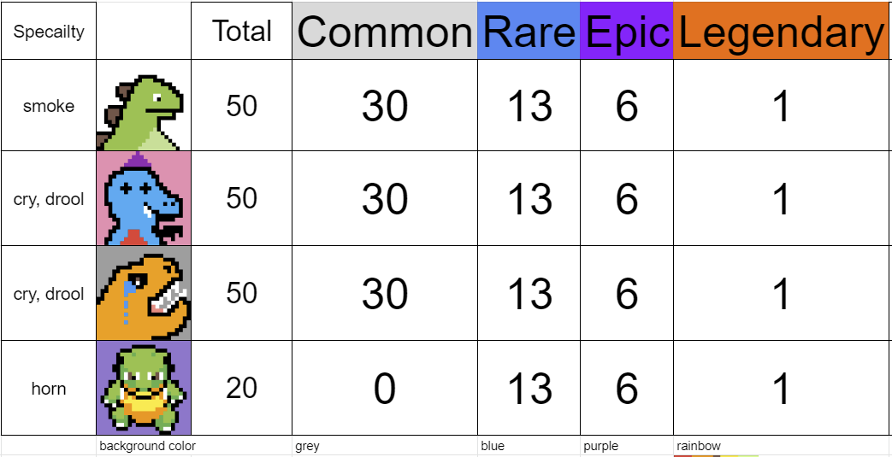

# Bit_Dino

## Intro
This repo is designed and created by us. It generates cool and meaningful bit dinosaurs in different designs and tiers. We aim to design our bit dino to fit today's fashions (we hope so), and to embody meaningful arts in each of the generated bit dinos because our ultimate goal is to make each of our bit dino be one of your valuable collections.

## Dependencies
To install required libraries, do this:
```
pip install -r requirements.txt
```

## Tiers



## Words at the end: 
This repo is inspired by creator of BitBirds:
https://github.com/nft-fun/generate-bitbirds

If you feel absolutely amazed, feel free to send us ETH or NFT to:
0xf8F0674fEB7ED26d9BF82a622a39F6d208De7785
